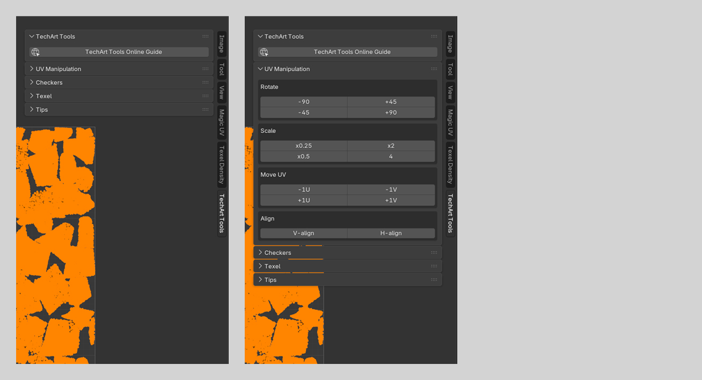
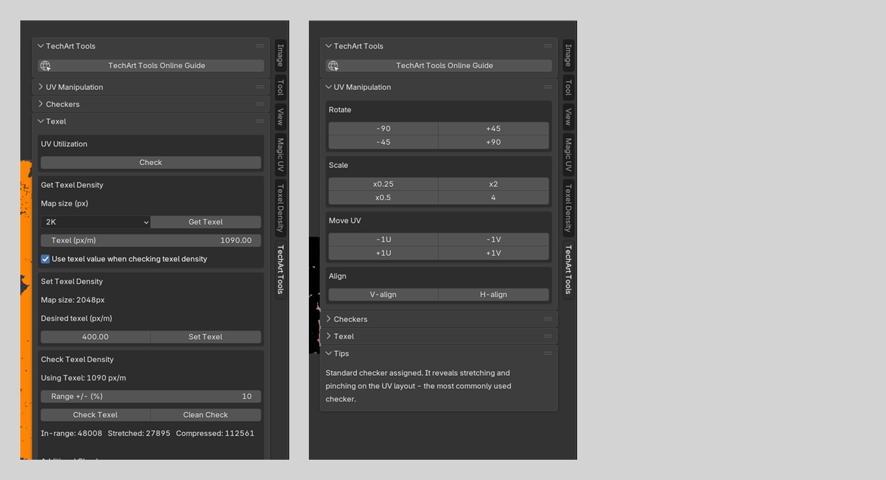
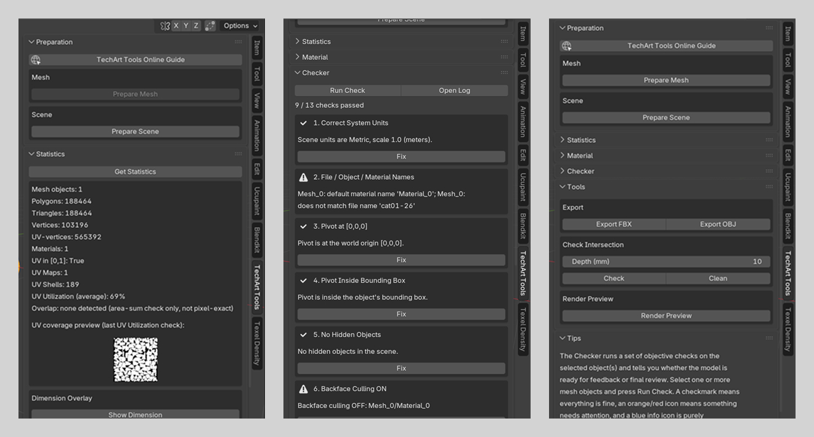

# TechArt Tools

**TechArt Tools** is a Blender 5.2+ extension that brings a set of technical-art checks and UV utilities into one place. It is built for game-art and hard-surface workflows: cleaning up UVs, verifying texel density, spotting distortion and flipped normals, and running a quick QA pass on a model before it goes for feedback or export.

The tool lives in two places, each opening with an **Online Guide** button linking back to this page:

* **UV Editor sidebar (N-panel → TechArt Tools tab)** — four collapsible sections: **UV Manipulation** (transforms), **Checkers** (checker textures, Render UV), **Texel** (UV utilization, texel density) and **Tools** (Export UV Layout).
* **3D Viewport sidebar (N-panel → TechArt Tools tab)** — seven collapsible sections: **Preparation** (batch mesh/scene cleanup), **Mesh Tools** (flatten selected vertices along a world axis), **Statistics** (mesh/UV stats and a bounding-box dimension overlay), **Material** (Gloss/Matte/NM check materials, AO baking, base texture set generation), **Checker** (13-point QA checklist), **Tools** (FBX/OBJ export, intersection check, viewport preview render, Auto LOD) and **Tips**.

All sections are collapsed by default so the sidebar stays short — expand only what you need. A **Tips** section appears after most actions with a short, contextual explanation of what just happened and why it matters.

Source code: [github.com/Ivanou-Dzmitry/techart-tools](https://github.com/Ivanou-Dzmitry/techart-tools)

## Requirements and Limitations

* Works with Mesh objects only.
* Most UV operations require Edit Mode with an active UV map.
* The Checker (QA checklist) requires Object Mode.
* Some functions work on a single object, others accept a multi-object selection — this is noted per feature below.
* Export, Render Preview and the bulk Preparation/Fix actions may prompt to save the file first if there are unsaved changes.

---

## UV Manipulation

### Auto UV

One-click unwrap for the whole mesh: applies rotation and scale on the object(s), then runs Cube Projection followed by Pack Islands (Rotate off, Scale on, with the **Margin** you set). Cube Projection keeps every island aligned to the object's own axes instead of the arbitrary rotation a Smart UV-style unwrap can pick — applying transform first guarantees those axes match World, so "up" stays up and "down" stays down. **Last run: N shells** shows the UV shell count after the most recent Unwrap (0 until it has been run) — it is not live, only a result of the last run.

### Rotate

Rotates the selected UVs around their median point by a fixed angle: **CW 90° / CW 45° / CCW 45° / CCW 90°**. Useful for straightening seams or fixing a wrong texture orientation before packing.

### Scale

Scales the selected UVs around their median point: **x0.25 / x0.5 / x2 / x4**. A quick way to balance texel density between UV islands without leaving Edit Mode.

### Move UV

Shifts the selected UVs by exactly one full tile along U or V: **-1U / +1U / -1V / +1V**. Handy for tiling textures or moving an island onto a neighboring UV tile.

### Flip

Mirrors the selected UVs around their median point: **Flip U** (horizontal) / **Flip V** (vertical). Equivalent to Blender's own UV Mirror, without leaving this panel.

### Align

* **V-align** — snaps all selected UVs to a single X coordinate (the median), producing a vertical line.
* **H-align** — snaps all selected UVs to a single Y coordinate (the median), producing a horizontal line.

Useful for straightening tileable trims and repeating patterns.

### Stack Similar

Finds UV islands with a similar bounding-box size, stacks them onto each other, and arranges the result into an orderly grid — handy for kit-bashed sets with many near-identical modules, so they can share the same texture space without leaving everything scattered across the UV tile. Islands are grouped by width/height within the **Range +/- (%)** tolerance, regardless of orientation (a duplicate rotated 90° still counts as similar), and every island in a group is moved - translated only, never scaled or rotated - onto the first island found in that group. The resulting distinct shapes (stacked groups and any islands left on their own) are then laid out left to right in a row, each separated by **Layout Margin**, wrapping to a new row once the next one would cross the UV tile's right edge. Press **To Stack**: with faces selected it only considers those, otherwise it scans the whole mesh. **Last run: N stacks** shows how many groups were stacked by the most recent run (0 until it has been run) — it is not live, only a result of the last run.

### Stack Distributor

Splits a single stack of overlapping UV islands (for example, one produced by Stack Similar) into evenly-sized groups and arranges those groups into rows — works on the current face selection only, there is no whole-mesh fallback.

* **Element Count** — counts the UV islands in the current selection and shows **Elements: N** (0 until it has been run — this is a snapshot from the last time you pressed it, not a live count).
* **Divide to** — how many groups to split the stack into. 100 elements divided by 2 gives two groups of 50; divided by 10 gives ten groups of 10. If it doesn't divide evenly, the extra elements go into the last group.
* **Margin** — gap left between the resulting groups.
* **Divide** — splits the selected stack (in its original order) into that many groups, each kept together as one rigid unit (the islands inside a group stay stacked exactly as they were), then shelf-packs the groups left to right across the UV tile with **Margin** between them, wrapping to a new row at the tile's right edge - the same layout Stack Similar uses.

---

## Checkers

A checker is a temporary texture applied to a model to visually inspect the UV layout before the final texture exists. TechArt Tools ships four:

* **Standard** — reveals stretching and pinching on the UV layout. The most commonly used checker.
* **Digital** — numbers make it easy to spot mirrored or flipped UV islands, which matters whenever the final texture will carry text.
* **Diagonal** — good for checking that seams line up and UV direction is consistent across neighboring islands. Mainly useful for camouflage-style textures.
* **Gradient** — shows roughly how UV space is distributed across the whole 0–1 tile. Does not tile.

Clicking a checker thumbnail assigns it to the selected object(s) and automatically switches the viewport to Material Preview shading so the result is immediately visible.

### Texture Size

Retiles the active checker to simulate a texture resolution: **128 / 256 / 512 / 1K / 2K / 4K / 8K**. This changes how many times the checker pattern repeats across the UV tile, matching what the real texture would look like at that resolution. Affects every tileable checker material in the scene (Gradient is excluded, since it is not meant to tile).

### Render UV

Exports the current UV layout (edges over a translucent fill, **Map Size** and **Fill Opacity** configurable) as `<mesh name>_uv.png` next to the `.blend` file, and applies it to the object as a texture — so you can see the UV layout directly on the model without opening the UV Editor, useful for spotting missing or broken UVs at a glance.

A **Remove Checker** button below the checker picker clears it — it restores whatever material was on the object before (see **Material**, in the 3D Viewport panel, for how that works).

---

## Texel

Groups everything about measuring and controlling how texture space is used: overall UV utilization and per-face texel density.

### UV Utilization

Reports what percentage of the 0–1 UV tile is actually covered by the mesh's UVs. The check renders the UV layout to an opaque-filled image and counts non-transparent pixels, so overlapping islands are **not** double-counted — a plain polygon-area sum would over-report coverage whenever UVs intentionally overlap (e.g. mirrored parts sharing texture space).

A thumbnail preview of the coverage mask is shown alongside the result. Rough guidance:

| Coverage | Meaning |
| :---- | :---- |
| < 25% | Poor — most of the texture space is wasted. |
| 25–33% | Low — packing could be noticeably tighter. |
| 33–60% | Moderate — there is still room to pack tighter. |
| 60–75% | Good. |
| 75–90% | Excellent. |
| > 90% | Very high — make sure there is still enough padding between islands to avoid texture bleeding. |

Near-zero coverage almost always means the UV islands are positioned outside the 0–1 tile — this check only counts what falls inside it.

### Texel Density

Texel density is the number of texture pixels that map onto one meter of real-world surface (px/m). It depends on object scale, texture resolution and UV area, and it is what tells you whether a texture will look sharp or blurry at a given distance.

#### Get Texel Density

Pick a **Map size** (64 up to 8K) and press **Get Texel**:

* If one or more faces are selected, the texel density is measured across that selection.
* If nothing is selected, a random face on the object is used instead.

The result is shown in px/m and, if "Use texel value when checking texel density" is enabled, is automatically carried over as the target for **Check Texel Density** below.

#### Set Texel Density

Enter a **Desired texel (px/m)** and press **Set Texel**. TechArt Tools measures the current texel density of the selected faces (or the whole object if nothing is selected) and scales their UVs so the result matches the target. Works with a multi-object Edit Mode selection.

* **Mode** — **Average** (default) scales the whole selection together by one factor, based on its combined average texel density, preserving the relative size differences between islands. **Each Cluster** finds every UV island in the selection (grouped by UV continuity) and scales each one individually to hit the target — useful when different islands start at different densities and all need to match exactly.
* **Scale Anchor (UV)** — the pivot point for the scale: **Selection** (the median of what's being scaled — the whole selection for Average, or each cluster's own median for Each Cluster), **Center** / **Left Bottom** / **Left Top** / **Right Bottom** / **Right Top** of the 0–1 UV tile, or **2D Cursor** (the UV Editor's 2D cursor position). With a fixed point instead of Selection, clusters scale from that shared point in Each Cluster mode, so they spread apart or converge as they resize, not just grow in place.

Increasing texel density enlarges the UV footprint — if the texture is not meant to tile, double-check afterwards that the islands still fit inside the 0–1 UV space.

#### Check Texel Density

Colors every polygon of the selected object(s) by how close its texel density is to the target:

* **Green** — in range.
* **Pink** — stretched (texel density above the target by more than the allowed margin).
* **Blue** — compressed (texel density below the target by more than the allowed margin).

**Range +/- (%)** sets the allowed tolerance (1–30%, default 10%). Example: target texel 200, range 10% → anything between 180 and 220 counts as in range.

##### Additional Checks

* **Tiny Polygons** — flags faces at or below a given world-space area (m²). Faces this small are usually invisible in the final render and can often be merged or removed.
* **Tiny UV Shells** — flags faces whose UV footprint is at or below a given size in pixels (relative to the selected Map size). There isn't enough texture space there to show any detail.

Each flagged category shows a **Select** button to jump straight to the offending faces.

##### Clean Check

Removes the check material and clears the results.

---

## Tools

### Export UV Layout

Exports the current UV set's layout as `<mesh name>_uv<N>.png` next to the `.blend` file, where `<N>` is the number of the active UV set (1 for the first UV map, 2 for the second, and so on). Pick a **Map Size** (64 up to 8K) and press **Export UV**. A plain export - no texture is applied back onto the object (see **Render UV**, in the Checkers panel, for that).

---

## 3D Viewport Panel

Seven collapsible sections, all under the **TechArt Tools** tab in the 3D Viewport sidebar (N-panel). Export, Render Preview and the bulk Preparation/Fix actions derive their output location from the saved `.blend` file: if there are unsaved changes they offer a **Save & Continue / Cancel** prompt first, and if the file has never been saved at all they just warn, since there is no path to derive an output from.

### Preparation

* **Prepare Mesh** — batch-cleans the selected object(s): unhides the object and any hidden vertices/edges/faces, clears "unselectable" locking, resets scale and rotation (Apply Transform), assigns a `<name>_mat` material to any object that has none, and switches backface culling on for all of its materials.
* **Prepare Scene** — batch-cleans the whole scene: sets units to Metric with a scale of 1.0, unhides every object and collection, and makes texture paths relative to the saved file.

### Mesh Tools

* **Align** (Edit Mode) — sets every selected vertex's position along the chosen world **Axis** (X/Y/Z) to the common average, flattening the selection into a plane. Works across a multi-object Edit Mode selection, averaging in world space.

### Statistics

* **Get Statistics** — reports mesh object count, polygons, triangles, vertices, armature bones (if any), UV-vertices, materials, whether UVs are within [0,1], UV map count, UV shell (island) count, and UV utilization (average and lowest, across a multi-object selection) — plus the same UV coverage preview thumbnail as the Texel panel's UV Utilization check, if one has been computed.
* **Dimension Overlay** (Show/Hide Dimension) — draws a live bounding-box wireframe with Width/Length/Height labels directly in the 3D Viewport for the selected object(s), following the current selection. A label turns red on any axis where the object has a non-1.0 scale, since the displayed size doesn't account for that transform.

### Material

Three groups, from the 3D Viewport:

**Common** — the same check materials as the UV Editor's Checkers panel:

* **Gloss** — assigns a glossy material (low roughness). Sharp specular highlights make it easier to spot faceting and other surface artifacts.
* **Matte** — assigns a matte material (high roughness). Neutral and easy on the eyes — good for a general shape and silhouette review.
* **NM** — assigns a test normal map with readable "UP" / "DOWN" text baked into it, revealing a flipped Y channel or mirrored UVs at a glance.
* **Reset** — restores whatever material was on the object *before* any check material (checker, Gloss, Matte, NM, Render UV, Check Texel Density, Bake AO) was applied, instead of just clearing the slot. TechArt Tools remembers the original the first time one of those is assigned.

**Bake AO** — bakes self-only Ambient Occlusion for the selected mesh(es) and saves it as `<mesh name>_ao.png` next to the `.blend` file. Builds a plain white material with an Image Texture node for each object and bakes into it with Cycles; every other object in the scene is temporarily hidden from render while an object bakes, so the result reflects only that object's own shape — not shadows cast by neighbouring objects. Options: **Map Size** (default 1024), **Samples** (default 256), **Margin** (px of dilation past each UV island's edge, to avoid black seams — default 16), **Denoise** (on by default). Requires the object to already have a UV map. The bake material is assigned to slot 0.

**Base Texture Set** — generates a flat-fill starting texture set for the selected mesh(es), next to the `.blend` file: `<mesh name><suffix>.png` for albedo (RGB, suffix defaults to `_am`), metal/AO/roughness (RGBA — Metal in R, AO in G, Roughness in Alpha, Blue unused, suffix defaults to `_maor`) and a flat tangent-space normal (suffix defaults to `_nm`) — each suffix is a text field next to its section, left empty to use the default. Pick a **Map Size** and a flat value for **Albedo**, **Metal**, **AO** and **Roughness** — if a `<mesh name>_ao` image already exists (for example from **Bake AO**), it is used for the AO channel instead of the flat value. **Get Current Maps** (off by default) reads Albedo/Metal/Roughness/Normal per object from its active material's Principled BSDF instead of a flat fill — an unconnected input's plain value is used as the fill, while an Image Texture feeding it (directly, or via a Normal Map node for Normal) is copied and resized into the output instead of being flattened to one value, so an already-textured object keeps its real detail. Falls back to the fields/flat normal for objects with no usable material. A quick, correctly named and correctly packed base to paint over.

### Checker (QA Checklist)

Press **Run Check** to evaluate the selected object(s) (Object Mode) against 13 checks, each shown with a colored status and, where it can be automated safely, a **Fix** button.

| # | Check | Fixable |
| :---- | :---- | :---- |
| 1 | Correct System Units — scene units should be Metric with a scale of 1.0 (meters). | Yes |
| 2 | Correct file / object / material names — flags default-looking names (Cube, Sphere, Material.001, …) and names that don't relate to the file name. | Manual |
| 3 | Pivot at the world origin [0,0,0]. | Yes |
| 4 | Pivot inside the object's bounding box. | Yes |
| 5 | No hidden objects or collections in the scene. | Yes |
| 6 | Backface culling is ON for every material. | Yes |
| 7 | No scale or rotation transform on the object (Apply Transform is expected before export). | Yes |
| 8 | Correct polygons — flags n-gons, non-planar and non-convex quads. | Yes (n-gons only — this changes topology) |
| 9 | Correct materials on the scene — flags unused materials in the file and objects with no material assigned. | Yes (assigns a default material where missing) |
| 10 | UV shells inside the [0,1] area. | Manual |
| 11 | Quantity of UV maps per object — informational, more than one is unusual for a simple model. | Manual |
| 12 | UV utilization — average and lowest coverage across the selection (50% / 75% thresholds). | Manual |
| 13 | Material slots per object — informational, more than one is unusual for a simple model. | Manual |

A short summary ("N / 13 checks passed") is shown at the top of the results. **Open Log** writes the full results, with a timestamp, to a Text data-block named `TechArt_Checker_Log` and prints the same to the console — open a Text Editor and select it, or use Window → Toggle System Console, to read it.

### Tools

* **Export FBX / Export OBJ** — exports the selected object(s) next to the saved `.blend` file (`<filename>.fbx` / `<filename>.obj`). A hard, minimal export: geometry, UV and normals only (FBX also includes tangent space) — no animation, cameras, lights or embedded textures, with `-Z Forward` / `Y Up` axes and triangulated output. **Use mesh name as file name** (off by default) names the file after the selected mesh instead of the `.blend` file — handy when a file has several meshes and you only want to export one at a time.
* **Check Intersection** — finds open (boundary) edges on the selected object(s) and traces them with a bright red tube (**Depth (mm)**, default 10). Where two parts are meant to overlap — a bolt into a block, for example — a visible red tube means the intersection there is too shallow. **Clean** removes the helper geometry.
* **Render Preview** — frames the selected object(s) (or the whole scene, if nothing is selected) in the current Perspective viewport and saves a snapshot as `<filename>_preview.jpg` next to the `.blend` file.
* **Auto LOD** — builds an LOD chain for the selected mesh(es). Creates a `<name>_LODS` collection, moves the original into it renamed to `<name>_LOD0`, then adds progressively decimated copies `_LOD1`–`_LOD3`, each roughly **Reduction per LOD** (default 50%) smaller than the one before — every generated LOD is a plain mesh with no live modifiers. Stops early (producing fewer levels) rather than reducing a LOD down to almost nothing, if another step would drop below a safe triangle count.

### Tips

A short, static explanation of what the Checker and Preparation sections do, plus a one-line summary after the last Run Check (what passed, what needs attention).

---

## Installation

1. Download the extension package (`techart_tools.zip`).
2. In Blender: **Edit → Preferences → Get Extensions** → dropdown (top right) → **Install from Disk…**
3. Select the zip file.
4. Open a UV Editor or the 3D Viewport, press `N` for the sidebar, and look for the **TechArt Tools** tab.

Requires Blender 5.2 or newer.
